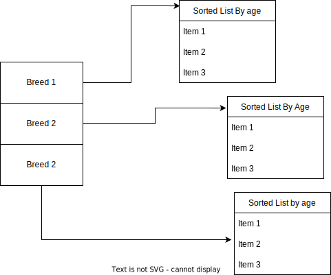

#Design Assumptions
1. Only breed and age will be used to query the data
2. Distributed Query platform would be an add-on and for the sake of brevity and clarity in implementation only stdlib and container libraries have been used

#Data structure
- Taking a look at the data, Essentially a large list of json values
- which can be mapped to an object schema this has been modeled in `database/schema.py`
- Additionally since the challenge mentions no image processing/storage only path is present in the output

example output
`{'pet_id': '4a5a02164', 'pet_type': 'cat', 'name': 'Layla', 'age': 60, 'breed': 'Calico', 'color': 'Brown', 'fur_length': 2, 'vaccinated': 1, 'gender': 2, 'entry_date': '2010-07-12T00:00:00', 'story': 'Layla was rescued from the streets with her kittens. Now that her kittens have all gone to their new families, Layla is looking for a family to call her own. She is a very good-natured and loving girl. She is playful and enjoys interacting with people. If you would like Layla to be a part of your family, please contact me. I am willing to provide transportation to her new home, if needed. The home she goes to should be a safe and loving home.', 'owner_location_id': None, 'owner_account_id': None, 'owner': {'owner_location_id': 41401, 'owner_account_id': 'f811de159444c96f3eb9a5a60c4f4d80'}, 'prefix_path': 'dataset_out/sweepstakes_sample/imgs', 'image_path': 'dataset_out/sweepstakes_sample/imgs/pet-4a5a02164.jpg'}`

#Storage
- The data currently loads each time from the files generated and does not save any intermediate representation, this could be a bottleneck as the amount of data scales and better solution would be to use parquet with partition column
- The reason for loading in memory each time is to show the concepts used in the other query engines in a more constrained scenario while also trying to avoid using formats such as parquet which is tied directly with frameworks like spark and would tie down implementation to using the spark ql

#Architecture
- Since the datasets query patterns mention only `breed` and `age` we can do some handy optimisations on how we query the database
  1. `breed` is an excellent candidate to be partition key at least one breed will be specified
  2. `age` is also a great candidate for an ordered key which can reduce search time from `O(n)` to `O(log n)` 
  3. The result is the max complexity of query with at least one breed provided `O(n)` where n is the number of dogs in that breed group
  4. When the age is provided the complexity drops to `O(log n)` as the structure allows for performing a binary search on the breed group list
  5. As the amount of data grows query performance should be stable as partitioning reduces the amount of data that needs to be scanned
  6. Since images are not directly queried they need not be loaded into memory and can be referenced via file path

#Improvements
- The challenge mentions that actual dataset could be in terabytes therefore a distributed query engine like dask or spark would be more suited at querying the data but the basic principles would remain the same
  1. Spark and dask both support partitioning and breed can be used as partition key
  2. both support Ordering partitions and distributed sorting
  3. the query engine could benefit from a binary storage format as deserialization time could increase startup time as the dataset size grows

#Tooling Considerations 
- Only breed and age can be used as query parameters, 
  1. if suppose more indices are needed, eg `id` datastructure will need to be changed to a computation graph which evaluates the clauses based on certain costs 
- Use of a more performant language
  1. while the constructs used here are quite performant due to being C extensions, python loops are slow and the benefits of static languages such as loop unrolling, AOT compilation and lazy evaluation for Lists could improve the performance further while also being easier to reason about. In this case python was chosen simply because it is fast to prototype in.
  2. Cache friendliness is also consideration, static languages allow the compiler to make changes to code so that certain structures are more cache friendly while dynamics ones don't have the option

